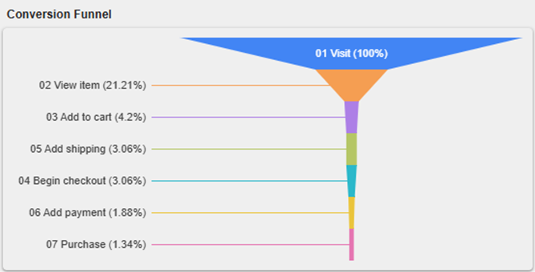
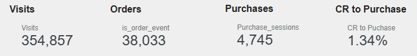
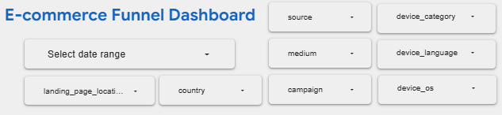

# E-Commerce Conversion Funnel & Traffic Analysis (Looker Studio Case Study)

## 📌 Business Overview & Challenge
A digital commerce retailer experienced a stagnation in customer conversion growth despite stable traffic inputs. The primary challenge was the lack of end-to-end visibility across the customer journey—from the initial web session to the final transaction. 

The goal of this project was to leverage advanced cloud SQL preprocessing inside Google BigQuery, build a unified data model, and deploy a highly automated, interactive dashboard in Looker Studio. This analytics suite isolates performance bottlenecks, measures exact micro-conversions, and diagnoses specific behavioral drop-off points.

👉 **[Live Looker Studio Dashboard Link](https://lookerstudio.google.com/reporting/a28fef3e-5508-4435-a566-0fd0f668eab8)**

## 🛠️ Tech Stack & Skills Demonstrated
* **Cloud Data Warehouse:** Google BigQuery (handling raw, high-volume clickstream logs).
* **Data Engineering & Preprocessing:** SQL (Advanced CTEs, dynamic aggregate metrics routing, window functions calculation, and data cleansing).
* **Business Intelligence (BI):** Looker Studio (interactive dashboard architecture, dynamic user controls implementation, custom funnel calculations).
* **Performance Analysis:** Cohort/Funnel optimization (CRO metrics tracking, drop-off identification).

## 📉 Core Funnel Metrics & Architecture
The logic tracks user progression through four distinct micro-conversion milestones:
`Sessions` ➡️ `Product Views` ➡️ `Add to Cart` ➡️ `Purchase`

* **Cart Abandonment Velocity (CR to Add to Cart):** **12.5%** of viewers proceed to add products.
* **Macro-Conversion Efficiency (CR to Purchase):** **3.4%** global session-to-purchase completion rate.

---

## 📐 Data Processing & SQL Framework (src/)
Instead of feeding messy, raw events directly into Looker Studio—which degrades query response times and complicates calculation metrics—all data was pre-aggregated using native standard SQL in BigQuery.

The pipeline computes conversion stages, parses traffic variables, and filters out system anomalies. The final script ensures index-level cleanliness and is stored inside the `/src` directory.

---

## 📊 Dashboard Insights & Strategic Findings

### 1. The Critical View-to-Cart Drop-off
The data reveals that the lowest-performing phase is the transitional bridge between product views and cart additions. This visually directs product managers to audit product page UI/UX barriers, sizing availability alerts, or localized price validation errors.



### 2. High-Value Top-Line KPIs
* **Core Elements:** High-level executive scorecards displaying global metrics with automatic period-over-period direction signals.



### 3. Traffic Acquisition & Sourcing Performance
* **Organic Supremacy:** Organic search traffic exhibits a structurally superior conversion velocity into the `Add to Cart` step compared to paid advertising banners.
* **Temporal Fluctuations:** Behavioral tracking isolated significant peak transaction surges during weekend periods, identifying clear optimization windows for targeted push marketing campaigns.


### 4. Interactive User-Intent Sorting & Controls
* **Core Elements:** Unified filtering panes embedded directly into the report. Decision-makers can dynamically slice behavioral charts by Date Ranges, Country, Devices (Desktop vs. Mobile), and Channel Mediums seamlessly without data latency.



---

## 📂 Repository Architecture
```text
E-commerce-Funnel/
├── src/                  # Production-ready SQL scripts (BigQuery data processing)
├── dashboard/            # Executive analytical report exported as PDF
├── images/               # High-resolution visual screenshots & technical assets
│   ├── funnel.PNG
│   ├── scorecards.png
│   ├── by source-medium.png
│   └── controls.png
├── README.md             # Professional business case-study documentation
└── .gitignore            # Local system file configuration flags
